# Phân tích mô tả - Bức tranh toàn cảnh

## 1. Tóm tắt KPI lịch sử và Xu hướng tăng trưởng
|   Năm | Doanh thu   | COGS    | Lợi nhuận gộp   | Biên LN gộp   | Conversion   | AOV   |   Revenue/Session |
|------:|:------------|:--------|:----------------|:--------------|:-------------|:------|------------------:|
|  2012 | 741.50M     | 587.46M | 154.04M         | 20.77%        | N/A          | 23.1K |             nan   |
|  2013 | 1.66B       | 1.47B   | 191.19M         | 11.54%        | 1.13%        | 21.6K |             243.6 |
|  2014 | 1.87B       | 1.57B   | 297.24M         | 15.88%        | 1.10%        | 23.2K |             255   |
|  2015 | 1.89B       | 1.67B   | 224.49M         | 11.88%        | 1.05%        | 22.9K |             240.4 |
|  2016 | 2.10B       | 1.78B   | 324.08M         | 15.40%        | 0.98%        | 25.6K |             250.5 |
|  2017 | 1.91B       | 1.69B   | 216.78M         | 11.34%        | 0.85%        | 25.1K |             212.5 |
|  2018 | 1.85B       | 1.54B   | 307.95M         | 16.64%        | 0.74%        | 26.6K |             196.5 |
|  2019 | 1.14B       | 1.01B   | 131.60M         | 11.58%        | 0.42%        | 27.3K |             113.8 |
|  2020 | 1.05B       | 886.09M | 168.43M         | 15.97%        | 0.33%        | 30.2K |              99.6 |
|  2021 | 1.04B       | 941.13M | 101.91M         | 9.77%         | 0.31%        | 30.2K |              94.9 |
|  2022 | 1.17B       | 1.02B   | 149.33M         | 12.77%        | 0.33%        | 32.5K |             105.7 |

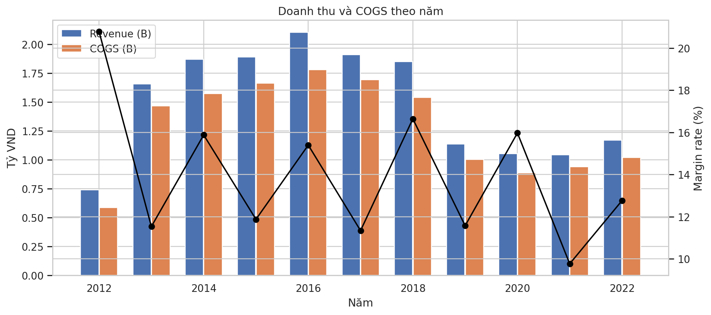

## 2. So sánh hiệu suất 2018 vs 2019
| Chỉ số | 2018 | 2019 | Thay đổi (%) |
|:---|:---|:---|:---|
| Doanh thu | 1.85B | 1.14B | -38.5% |
| Lưu lượng (Sessions) | 9.42M | 9.99M | +6.1% |
| Tỷ lệ chuyển đổi | 0.74% | 0.42% | -43.2% |
| AOV | 26.6K | 27.3K | +2.6% |
| Revenue/Session | 196.5 | 113.8 | -42.1% |

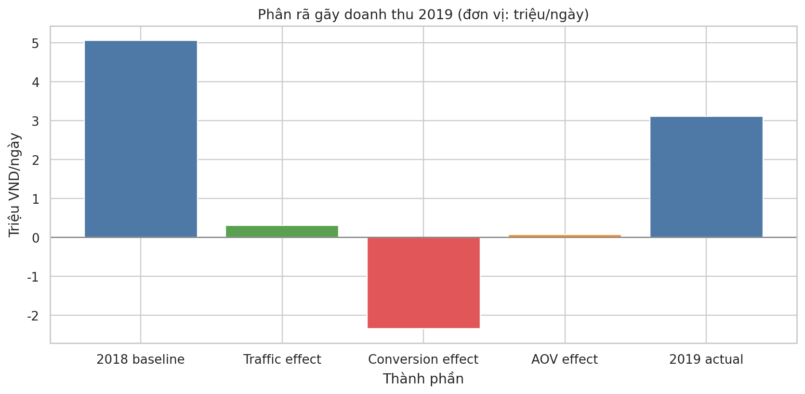
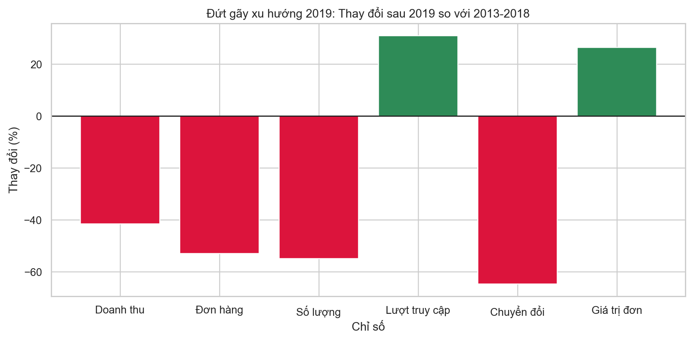

## 3. Chênh lệch tháng 8 (Năm lẻ vs Năm chẵn)
| Nhóm năm | Revenue TB ngày | COGS TB ngày | Biên LN |
|:---|:---|:---|:---|
| **Năm chẵn** | 5.44M | 4.35M | 19.96% |
| **Năm lẻ** | 3.25M | 4.35M | -36.35% |

## 4. Hiệu suất theo Quý
| Quý | Doanh thu | COGS | Lợi nhuận | Biên LN |
|:---:|:---|:---|:---|:---|
| Q1 | 3.31B | 2.76B | 552.57M | 16.68% |
| **Q2** | **5.93B** | **4.91B** | **1.02B** | **17.21%** |
| Q3 | 4.34B | 4.02B | 326.56M | 7.52% |
| Q4 | 2.85B | 2.48B | 368.19M | 12.92% |

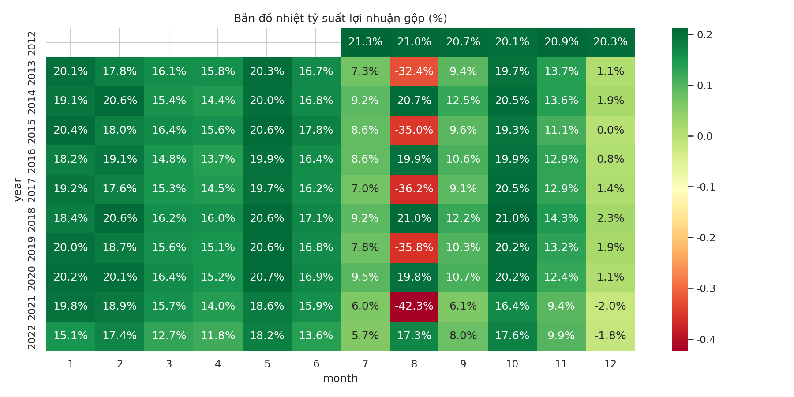
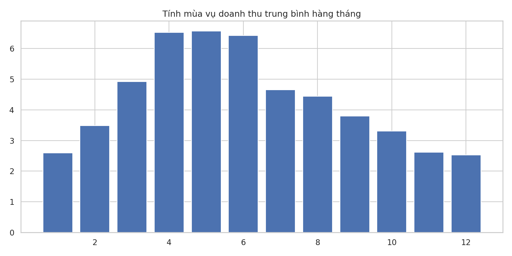

## 5. Phân khúc khách hàng và Thị trường
### Hiệu suất theo Khu vực (Region)
| Khu vực | Doanh thu | Tỷ trọng | Biên LN |
|:---|:---|:---|:---|
| East | 7.29B | 46.6% | 9.54% |
| Central | 4.72B | 30.2% | 9.39% |
| West | 3.67B | 23.2% | 10.32% |

### Hiệu suất theo Thiết bị
| Thiết bị | Doanh thu | Tỷ trọng | Biên LN |
|:---|:---|:---|:---|
| Mobile | 7.07B | 45.1% | 9.72% |
| Desktop | 6.27B | 40.0% | 9.70% |
| Tablet | 2.35B | 14.9% | 9.49% |

### Hiệu quả theo Nguồn Traffic (Order Source)
| Nguồn Traffic | Doanh thu | Biên LN |
|:---|:---|:---|
| Organic Search | 4.38B | 9.69% |
| Paid Search | 3.44B | 9.64% |
| Social Media | 3.14B | 9.70% |
| Email Campaign | 1.88B | 9.79% |
| Referral | 1.57B | 9.51% |
| Direct | 1.26B | 9.69% |

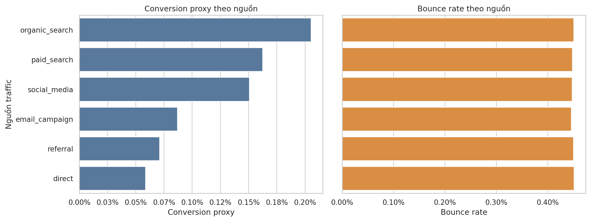

### Phân bổ theo Độ tuổi
| Nhóm tuổi | Doanh thu | Biên LN |
|:---|:---|:---|
| 18-24 | 2.15B | 9.67% |
| 25-34 | 4.63B | 9.68% |
| 35-44 | 4.13B | 9.65% |
| 45-54 | 3.02B | 9.80% |
| 55+ | 1.75B | 9.53% |

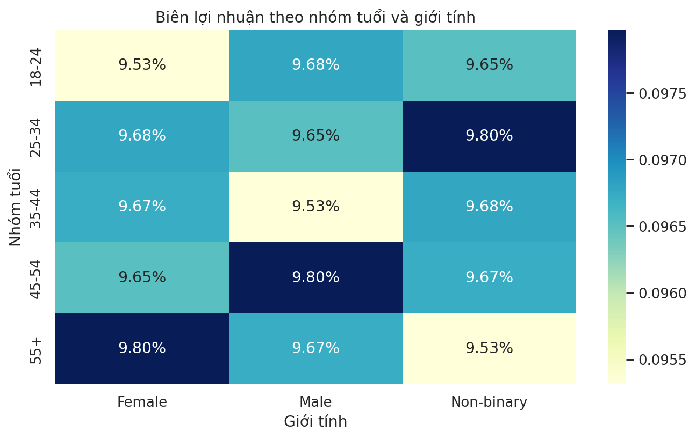

### Tỷ lệ hoàn hàng (Returns)
| Phương thức thanh toán | Tỷ lệ hoàn |
|:---|:---|
| COD | 8.9% |
| Credit Card | 5.0% |
| Paypal/Apple Pay/Bank Transfer | ~5.0% |

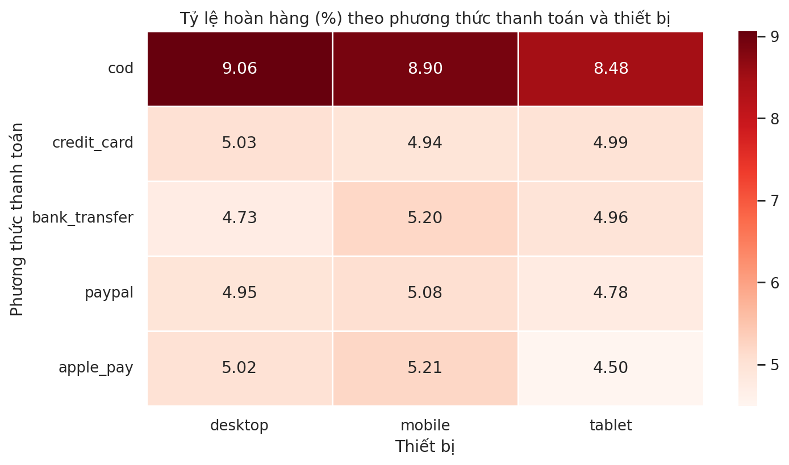

## 6. Phân tích Biến động giá và Độ nhạy sản phẩm
### Thống kê thay đổi giá các SKU chủ lực
| Sản phẩm | Mức giá | Giá đơn vị (K) | Sản lượng | Doanh thu (M) |
|:---|:---|:---:|:---:|:---:|
| **SaigonFlex UM-92** | Thấp nhất | 6.1K | 3 | 0.02 |
| | Phổ biến nhất | 12.8K | 18 | 0.23 |
| | Cao nhất | 13.9K | 5 | 0.07 |
| **HanoiStreet UM-10** | Thấp nhất | 6.0K | 2 | 0.01 |
| | Phổ biến nhất | 12.4K | 16 | 0.20 |
| | Cao nhất | 13.7K | 7 | 0.10 |
| **SaigonFlex UM-43** | Thấp nhất | 5.6K | 2 | 0.01 |
| | Phổ biến nhất | 11.6K | 16 | 0.19 |
| | Cao nhất | 12.6K | 3 | 0.04 |

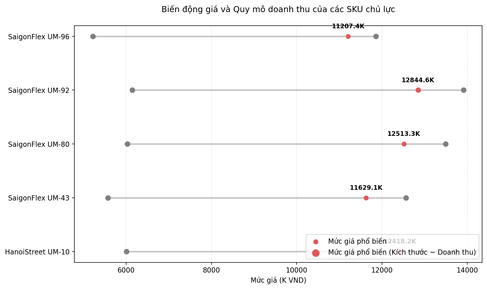

## 7. Top Sản phẩm đóng góp doanh thu cao nhất
| Xếp hạng | Tên sản phẩm | Danh mục | Phân khúc | Doanh thu | Số lượng bán |
|:---:|:---|:---|:---|:---|:---|
| 1 | SaigonFlex UM-92 | Streetwear | Balanced | 380.47M | 33,277 |
| 2 | HanoiStreet UM-10 | Streetwear | Balanced | 327.51M | 28,993 |
| 3 | SaigonFlex UM-43 | Streetwear | Balanced | 325.01M | 31,471 |
| 4 | SaigonFlex UM-80 | Streetwear | Balanced | 256.55M | 22,709 |
| 5 | SaigonFlex UM-96 | Streetwear | Balanced | 241.00M | 24,485 |
| 6 | SaigonFlex UC-69 | Streetwear | Everyday | 199.00M | 36,515 |
| 7 | SaigonFlex UM-11 | Streetwear | Balanced | 192.41M | 14,249 |
| 8 | UrbanVN UE-05 | Streetwear | Performance | 177.11M | 35,858 |
| 9 | SaigonFlex UM-54 | Streetwear | Balanced | 175.84M | 15,992 |
| 10 | SaigonFlex UM-01 | Streetwear | Balanced | 171.20M | 17,339 |

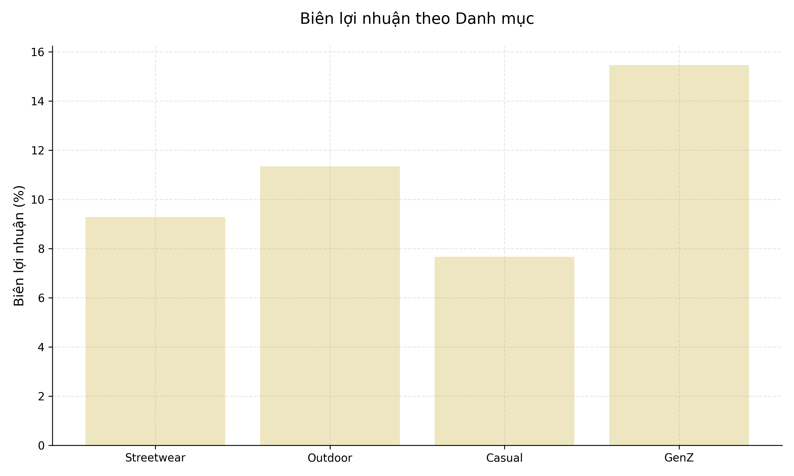

## 7. Hiện trạng Kho bãi và Tồn kho
### Chỉ số thiếu hàng (Shortages)
| Tên sản phẩm | Danh mục | Phân khúc | Số ngày thiếu hàng (TB tháng) |
|:---|:---|:---|:---|
| HanoiStreet RP-08 | Outdoor | Activewear | 13.7 |
| HanoiStreet RP-07 | Outdoor | Activewear | 13.3 |
| MekongFit UE-13 | Streetwear | Performance | 12.8 |

### Chỉ số quay vòng sản phẩm (Turnover)
| Nhóm | Tên sản phẩm | Danh mục | Phân khúc | Chỉ số Turnover |
|:---|:---|:---|:---|:---|
| **Fast** | HanoiStreet YY-08 | GenZ | Trendy | 28.4 |
| **Fast** | VietMode RP-74 | Outdoor | Activewear | 26.2 |
| **Fast** | SaigonCore YY-43 | GenZ | Trendy | 26.2 |
| **Slow** | VietMode RS-88 | Outdoor | Premium | 0.94 |
| **Slow** | HanoiStreet RP-27 | Outdoor | Activewear | 1.02 |
| **Slow** | HanoiStreet RP-28 | Outdoor | Activewear | 1.06 |

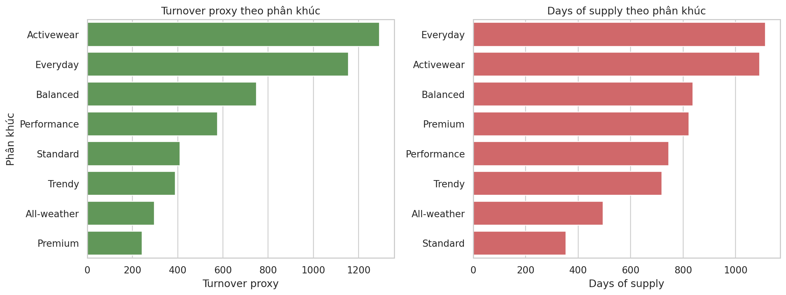

## 8. Phân tích Đánh giá Sản phẩm (Reviews)
### Top sản phẩm theo mức độ hài lòng (Avg Rating)
| Phân loại | Sản phẩm | Rating TB | Số lượng | Nội dung chính |
|:---|:---|:---:|:---:|:---|
| **Tốt** | MekongFit MA-02 | 4.64 | 22 | High Quality, Highly Recommend |
| **Tốt** | SaigonCore YY-31 | 4.58 | 12 | Excellent Product, Great Quality |
| **Tốt** | HanoiStreet UC-48 | 4.56 | 25 | Great Quality, Satisfied |
| **Xấu** | SaigonFlex UC-41 | 3.08 | 12 | Poor Quality, Below Expectations |
| **Xấu** | LotusWear UC-03 | 3.18 | 11 | Not Recommend, Some Issues |
| **Xấu** | HanoiStreet UC-03 | 3.31 | 35 | Very Disappointed, Not Reorder |
| **Xấu** | UrbanVN RP-21 | 3.18 | 11 | Not as Described, Poor Quality |

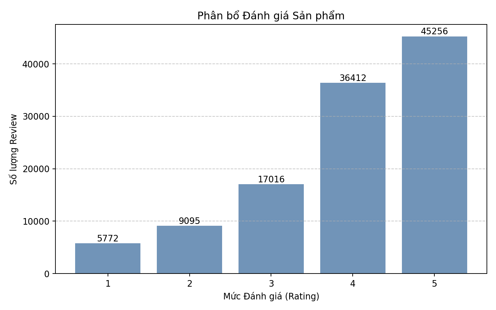

## 9. Phân tích Đơn hàng
### Chỉ số vận hành đơn hàng
| Chỉ số | Giá trị |
|:---|:---|
| Số lượng sản phẩm trung bình/đơn (Basket Size) | 4.97 |
| Thời gian giao hàng trung bình (Ngày) | 6.00 |
| Tỷ lệ đơn hàng sử dụng mã giảm giá | 38.66% |

### Phân bổ Trạng thái đơn hàng
| Trạng thái | Tỷ lệ (%) |
|:---|:---|
| Thành công (Delivered) | 79.87% |
| Đã hủy (Cancelled) | 9.19% |
| Hoàn hàng (Returned) | 5.59% |
| Khác (Đang giao, Đã thanh toán...) | 5.35% |

### Phân bổ Phương thức thanh toán
| Phương thức | Tỷ lệ (%) |
|:---|:---|
| Thẻ tín dụng (Credit Card) | 55.08% |
| Paypal | 15.00% |
| Thanh toán khi nhận hàng (COD) | 14.94% |
| Apple Pay | 10.01% |
| Chuyển khoản (Bank Transfer) | 4.97% |

## 9. Phân tích Chi tiết Lượng đơn và Giá trị trung bình (AOV)
### Theo Năm (Xu hướng đơn hàng)
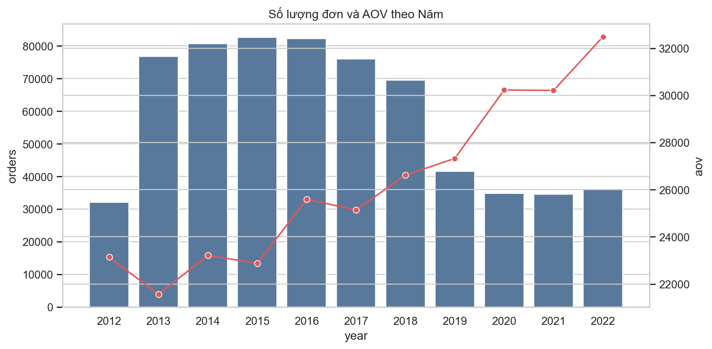

### Theo Khu vực (Phân bổ đơn hàng)
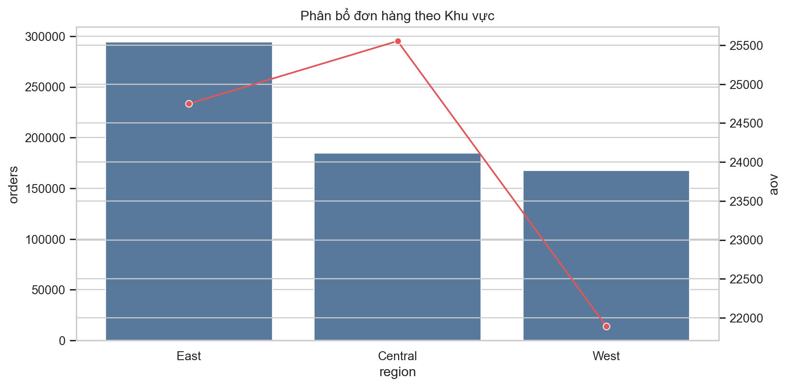

### Theo Thiết bị (Phân bổ đơn hàng)
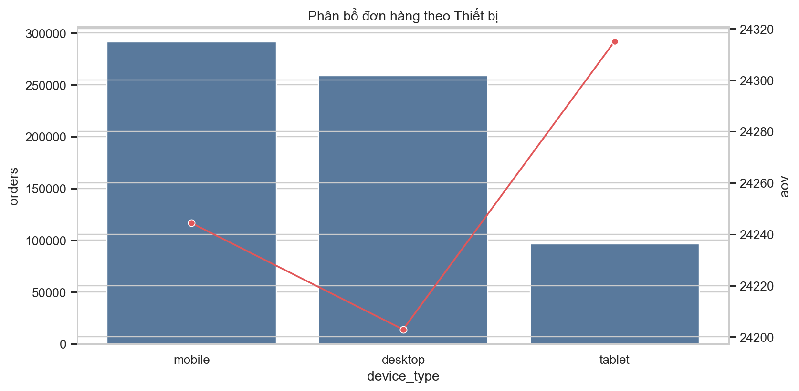

### Theo Nhóm tuổi (Phân bổ đơn hàng)
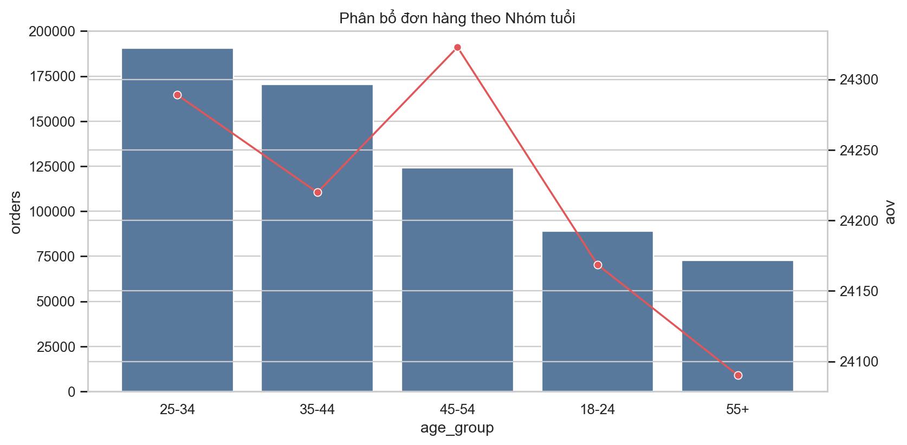

### Theo Tháng (Mùa vụ đơn hàng)
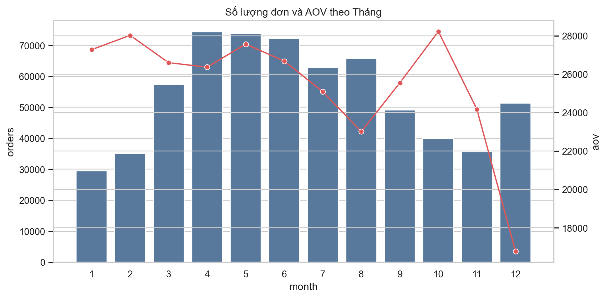

